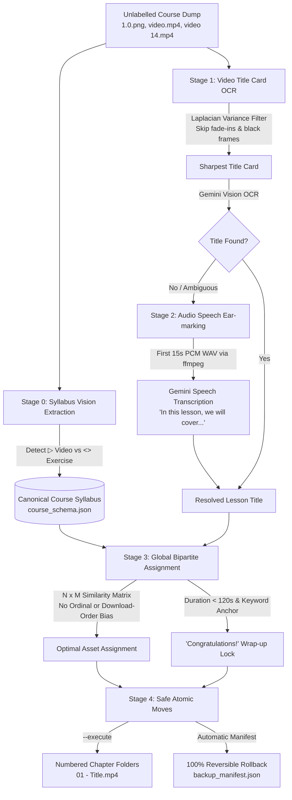

# DataCamp Course Resequencer

[](https://www.python.org/)
[](https://opensource.org/licenses/MIT)
[](https://github.com/psf/black)

An autonomous, multimodal resequencing engine that transforms chaotic, unlabelled course video dumps (`video.mp4`, `video (14).mp4`) into clean, numbered chapter libraries using **Computer Vision OCR**, **Audio Speech Ear-marking**, and **Bipartite Assignment**—with **zero chronological bias** and **zero scraped transcripts required**.

---

## The Origin & Philosophy

### 1. Built for the Offline Learner (Digital Equity)
Most modern online learning platforms assume continuous high-speed broadband and 24/7 reliable electricity. For learners in regions with fluctuating power grids and expensive mobile data, streaming high-definition video during study hours is a luxury.

If you are a paying subscriber, having ready offline access to study materials during outages is essential. This pipeline was built out of the necessity to make offline study seamless for paying subscribers in resource-constrained environments.

### 2. The Multi-Tab Reality (Why Chronological Sorting Fails)
When saving course videos manually for offline review, learners typically open course lessons across multiple browser tabs and trigger downloads in parallel.

Because parallel downloads compete for bandwidth, **they finish based on file size and connection speed, not syllabus sequence**. A 45-second wrap-up video initiated in Tab 10 will land on disk minutes before a 5-minute deep dive initiated in Tab 2.

Sorting by download time (`st_mtime`) or browser collision numbers (`video (1).mp4`, `video (2).mp4`) is a guaranteed recipe for corrupted, out-of-order course sequences. This tool enforces a strict mandate: **Zero chronological bias**. Every asset is matched strictly by its intrinsic multimodal content.

### 3. Eliminating the Scraper Tax (Pure Video Mode)
Early workflows relied on web page scraping and markdown transcripts. While accurate, requiring learners to install browser extensions (such as Affine) and click through extra export steps adds adoption friction to every single download cycle.

The primary capability of this tool is **Pure Video Mode**: drop in raw, unlabelled `.mp4` files alongside syllabus outline screenshots, and let multimodal AI (Vision + Audio Speech) do 100% of the cognitive lifting.

---

## How It Works: Multi-Signal Resequencing

Instead of guessing or relying on timestamps, the engine uses content-derived corroboration:



### The Multimodal Pillars
1. **Play Icon (`▶`) Syllabus Extraction:** Vision AI parses outline screenshots, distinguishing video lessons (`▶`, 50 XP) from interactive coding exercises (`<>`, 100 XP) to reconstruct the canonical course syllabus.
2. **Global Count Constraint Gate:** Enforces an atomic pre-flight check: total syllabus video lessons *must* equal total `.mp4` files on disk before moving files.
3. **Laplacian Title Card OCR:** Evaluates early video frames (`0.5s` to `3.0s`) with Laplacian variance, discarding dark fades and selecting the crispest frame for Gemini OCR.
4. **Opening Audio Speech Fallback:** If a video lacks a clear title card, `ffmpeg` extracts the first 15 seconds of audio. Gemini transcribes the instructor's opening sentence (where instructors almost universally introduce the topic: *"Welcome back, in this video we will discuss..."*).
5. **Global Bipartite Assignment:** Formulates matching as an assignment problem over an $N \times M$ similarity matrix between detected titles and syllabus slots. Completely immune to out-of-order downloads.
6. **"Congratulations!" Wrap-Up Anchor:** Automatically identifies the course conclusion lesson using duration constraints ($< 120\text{s}$) and keyword anchoring.
7. **Airtight Rollback (`--restore`):** Moves files with checksum tracking in `backup_manifest.json`. If anything ever looks wrong, a single command reverts every file to its exact original name and folder.

---

## Quick Start

### Prerequisites
- **Python 3.10+**
- **FFmpeg & FFprobe** on your system `PATH`:
  * *Windows:* `winget install ffmpeg`
  * *macOS:* `brew install ffmpeg`
  * *Linux:* `sudo apt-get install ffmpeg`
- A Google Gemini API key (Free Tier works out of the box).

### Installation
```bash
git clone https://github.com/joejamal029/datacamp-course-resequencer.git
cd datacamp-course-resequencer

# Create virtual environment
python -m venv .venv
source .venv/bin/activate  # Windows: .\.venv\Scripts\Activate.ps1

pip install -r requirements.txt
```

### Configuration
Create a `.env` file in the tool directory:
```env
GEMINI_API_KEY=your_gemini_api_key_here
GEMINI_MODEL=gemini-3.5-flash-lite
```

---

## CLI Usage

### 1. Dry Run (Preview without touching disk)
```bash
python remediate.py "path/to/course_folder"
```

### 2. Pure Video Mode (Standard / No Transcripts Needed)
```bash
python remediate.py "path/to/course_folder" --mode pure_video --execute
```

### 3. Instant Rollback (`.bak` System)
Reverts every file to its exact original name and flat location:
```bash
python remediate.py "path/to/course_folder" --restore
```

### 4. Batch Processing
Organize an entire library of courses at once:
```bash
python remediate.py "path/to/courses_directory" --batch --execute
```

---

## Project Structure

```
datacamp-course-resequencer/
├── remediate.py           # CLI entry point (dry-run, --execute, --restore, --batch, --mode)
├── schema_extractor.py    # Vision AI syllabus parser (outline images -> course_schema.json)
├── md_parser.py           # Regex extractor for deterministic (?ex=N) footer URLs (Enhanced Mode)
├── video_identifier.py    # Multi-timestamp frame extractor, sharpness scorer, and OCR
├── audio_identifier.py    # Opening audio extractor (15s WAV) & speech transcription fallback
├── matcher.py             # Dual matching engine (Enhanced multi-signal & Pure Video bipartite)
├── file_ops.py            # Manifest generator, safe mover, and backup/restore engine
├── config.py              # Environment configuration, constants, and thresholds
├── utils.py               # Sanitization, Laplacian sharpness, hashing, time utilities
├── requirements.txt       # Python dependencies
├── .env.example           # Example configuration template
├── .gitignore             # Ignore keys, cache, and OS files
├── SKILL.md               # Portable agent skill definition
└── README.md              # Documentation
```

---

## A Blueprint for Messy Media Remediation

While built and tested against DataCamp exports, this architecture serves as a broader blueprint for automated remediation of unstructured, unlabelled media:
- Combining vision, audio ear-marking, and structured schemas to reconstruct hierarchy.
- Eliminating fragile chronological assumptions in favor of content-derived graph assignment.
- Pairing autonomous file reorganization with non-destructive, single-command rollback manifests.

---

## Disclaimer & Fair Use

This tool is an independent, open-source local file utility created strictly for educational purposes and personal accessibility. It does not download, scrape, host, distribute, or bypass any access controls for proprietary course materials. Users are solely responsible for ensuring their use complies with the terms of service of the respective platforms and applicable copyright laws.

---

## License

This project is licensed under the MIT License.
