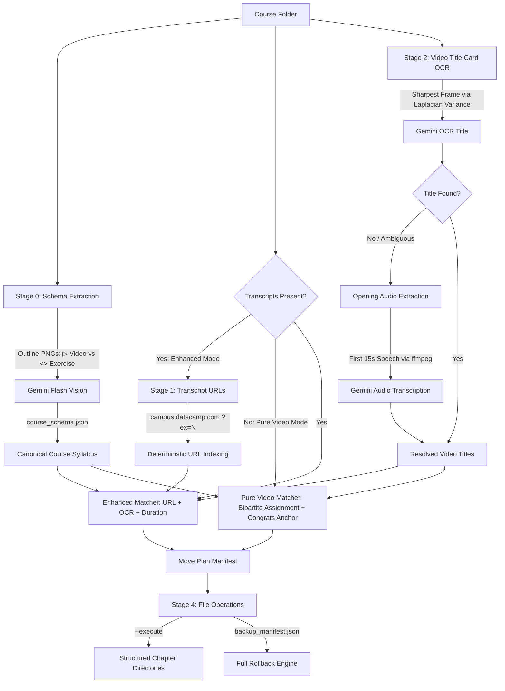

# DataCamp Course Remediation Pipeline

[](https://www.python.org/)
[](https://opensource.org/licenses/MIT)
[](https://github.com/psf/black)

An autonomous, multi-signal remediation engine designed to transform flat, disorganized dumps of downloaded DataCamp courses into clean, structured, and numbered chapter libraries with **zero silent misfiles**.

---

## The Problem

When downloading courses in parts, assets typically land in a single unorganized folder:
* **Unnamed Videos:** Files named generically like `video.mp4`, `video (1).mp4`, `video (10).mp4`.
* **Noisy Transcripts:** Markdown files with extra suffixes, e.g. `Multi-step prompting _ OpenAI.md` or `Deployment _ Theory.md`.
* **Chapter Outlines:** Loose screenshots (`1.0.png`, `2.0.png`...) showing the syllabus.

Sorting dozens of lessons manually is tedious and prone to errors. Furthermore, naive matching algorithms fail because:
1. Videos are often downloaded asynchronously or out of order.
2. Title cards may fade in after 1–2 seconds.
3. Some lessons share identical or near-duplicate titles across chapters.

---

## The Solution

This tool combines **deterministic parsing**, **computer vision OCR**, **audio/video duration analysis**, and **smart multi-signal corroboration** to match every video and transcript to its canonical position in the course syllabus.

```
Raw Flat Folder                                      Organized Course
-------------------                                  ----------------
1.0.png                                              ├── Chapter 1 - Introduction/
2.0.png                                              │   ├── 01 - What is the API.mp4
video.mp4                                            │   ├── 01 - What is the API.md
video (10).mp4             =================>        │   ├── 05 - First Request.mp4
Multi-step prompting.md                              │   └── 05 - First Request.md
What is the API.md                                   ├── Chapter 2 - Advanced/
...                                                  │   └── ...
                                                     ├── course_schema.json
                                                     ├── move_plan.json
                                                     └── backup_manifest.json
```

---

## Key Features

* **Dual Operating Modes (Auto-Detected):**
  * **Enhanced Mode (Markdown Transcripts Available):**
    * **Deterministic URL Indexing:** Extracts `(chapter_slug, ex)` directly from transcript footer URLs for 100% ground-truth lesson identification.
    * **Multi-Signal Corroboration:** Combines URL mapping, OCR title cards, and timestamp duration cross-checking.
  * **Pure Video Mode (No Transcripts Needed — 95% of users):**
    * **Play Icon (`▶`) Syllabus Extraction:** Vision AI distinguishes video lessons (play triangle, 50 XP) from coding exercises (`<>`, 100 XP) from outline screenshots.
    * **Global Count Constraint Gate:** Verifies that detected syllabus videos match the exact number of `.mp4` files.
    * **Vision AI Title Card OCR:** Extracts sharpest title frame (0.5s–3.0s) via Laplacian variance filtering.
    * **Opening Audio Speech Fallback:** If OCR fails or is ambiguous, extracts the first 15 seconds of audio via `ffmpeg` and uses Gemini to transcribe the instructor's opening topic announcement (e.g. *"In this lesson, we'll cover text generation..."*).
    * **Global Bipartite Assignment:** Matches videos to schema slots using an N×N similarity matrix. **Zero chronological bias, zero download-order bias, and zero ordinal alignment.**
    * **"Congratulations!" Anchor:** Detects course wrap-up video and locks it to the final syllabus slot.
* **100% Rollback Protection (`--restore`):** Every execution writes a `backup_manifest.json`. If anything looks wrong, a single command restores all files back to their exact original names and paths.
* **Dry-Run by Default:** Inspect the full execution manifest (`move_plan.json`) before moving a single file on disk.
* **Zero Dependencies Outside Standard Open-Source Stacks:** Uses `google-genai` / Gemini Flash for free-tier speed, `opencv-python` for frame sharpness scoring, and `ffmpeg` for frame and audio extraction.
* **Fully Idempotent:** Safe to run repeatedly; detects already-organized folders and performs zero redundant operations.
* **Batch Processing:** Organize an entire library of courses with a single `--batch` flag.

---

## Installation

### 1. Prerequisites
* **Python 3.10+**
* **FFmpeg and FFprobe:** Ensure `ffmpeg` and `ffprobe` are installed and available on your system `PATH`.
  * *Windows:* `winget install ffmpeg`
  * *macOS:* `brew install ffmpeg`
  * *Linux:* `sudo apt-get install ffmpeg`

### 2. Clone and Setup
```bash
git clone https://github.com/your-username/datacamp-remediation.git
cd datacamp-remediation

# Create and activate virtual environment
python -m venv .venv
source .venv/bin/activate  # On Windows: .\.venv\Scripts\Activate.ps1

# Install requirements
pip install -r requirements.txt
```

### 3. Configure API Key
Create a `.env` file in the project directory:
```env
GEMINI_API_KEY=your_gemini_api_key_here
GEMINI_MODEL=gemini-2.5-flash
```

---

## Usage

### 1. Dry Run (Preview Changes)
Simulate the reorganization and generate the audit manifest without touching files:
```bash
python remediate.py "/path/to/course_folder"
```

### 2. Execute Organization
Organize the course into structured chapter folders with automatic backup manifest creation:
```bash
python remediate.py "/path/to/course_folder" --execute
```

### 3. Pure Video Mode (Explicit)
Organize videos without markdown transcripts (ignores .md files if present):
```bash
python remediate.py "/path/to/course_folder" --mode pure_video --execute
```

### 4. Instant Rollback / Restore
Restore all files back to their original names and locations:
```bash
python remediate.py "/path/to/course_folder" --restore
```

### 5. Batch Mode
Process all courses inside a parent learning directory:
```bash
python remediate.py "/path/to/all_courses" --batch --execute
```

---

## Architecture & Pipeline Flow



---

## Project Structure

```
remediation_tool/
├── remediate.py           # CLI entry point (dry-run, --execute, --restore, --batch, --mode)
├── schema_extractor.py    # Vision AI syllabus parser (outline images -> course_schema.json)
├── md_parser.py           # Regex extractor for deterministic (?ex=N) footer URLs
├── video_identifier.py    # Multi-timestamp frame extractor, sharpness scorer, and OCR
├── audio_identifier.py    # Opening audio extractor (15s WAV) & speech transcription fallback
├── matcher.py             # Dual matching engine (Enhanced multi-signal & Pure Video bipartite)
├── file_ops.py            # Manifest generator, safe mover, and backup/restore engine
├── config.py              # Environment configuration, constants, and thresholds
├── utils.py               # Sanitization, Laplacian sharpness, hashing, time utilities
├── requirements.txt       # Python dependencies
├── .env.example           # Example configuration template
├── .gitignore             # Ignore keys, cache, and OS files
└── README.md              # Documentation
```

---

## License

This project is licensed under the MIT License.
